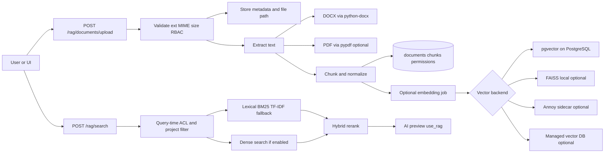
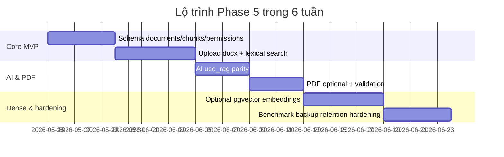

# Phase 5 RAG nâng cấp cho QLDA TeamsWork

## Executive summary

Nhánh `feature/post-mvp-task-ai-ops` đã có một lớp RAG tối thiểu: kho tài liệu nội bộ, endpoint `POST /rag/documents`, `GET /rag/documents`, `DELETE /rag/documents/{id}`, `POST /rag/query`, quyền `rag.manage` và `rag.query`, cùng logic chia đoạn và truy vấn theo **token overlap**. Cụ thể, `chunk_text` hiện đặt `MAX_CHUNK_CHARS = 900`, còn `query_rag` chấm điểm bằng mức chồng lắp term query–chunk; AI preview text chỉ gọi RAG khi `use_rag=true`, trong khi endpoint `.docx` trên branch công khai vẫn gọi `query_rag(text, limit=5)` trực tiếp. Điều đó cho thấy repo đã có “Phase 4.5”, nhưng chưa phải Phase 5 đầy đủ vì chưa có upload `.pdf`, chưa có embedding/vector store, chưa có ACL từng tài liệu/chunk, và chưa có cơ chế storage/file lifecycle rõ ràng. citeturn2view2turn14view1turn15view0turn19view0

Với ràng buộc của repo — RBAC cấu hình được, local/dev dùng SQLite, production-like dùng PostgreSQL, `AGENTS.md` cấm thêm dependency nếu chưa có trade-off rõ, và AI chỉ được hỗ trợ preview chứ không tự import — phương án phù hợp nhất là **lexical-first, embedding-optional, PostgreSQL-optimized nhưng SQLite vẫn chạy được**. Nghĩa là Phase 5 nên ship theo lộ trình: upload + extract + chunk + ACL + lexical retrieval trước; dense retrieval chỉ bật khi có `RAG_EMBEDDING_ENABLED=true` và backend phù hợp như `pgvector` hoặc provider managed. citeturn2view0turn2view2turn16view0turn17view4

## Mục tiêu sản phẩm và ràng buộc

Mục tiêu Phase 5 là biến RAG hiện tại từ “keyword context helper” thành “knowledge layer có kiểm soát”: nhận tài liệu `.docx/.pdf`, lưu metadata theo project, áp ACL theo role/project/document, truy hồi chunk liên quan để bơm vào AI preview khi `use_rag=true`, và vẫn giữ human review/import cho task thật. Repo hiện đã có AI draft lifecycle `draft -> reviewed -> imported`, nên RAG mới chỉ cần cấp ngữ cảnh cho preview chứ không được chạm sang quyền import. citeturn2view2turn2view3turn2view0

Ràng buộc đã biết gồm: RBAC hiện có là `admin/manager/staff/hr` với bảng permission cấu hình được; local/dev dùng SQLite còn docker/production-like dùng PostgreSQL; quality gate tối thiểu là `pytest -q`; UI phải compact, dense, role-aware theo `DESIGN.md`; và thay đổi lớn không nên kéo thêm dependency bắt buộc. Branch hiện có `python-docx` nhưng chưa có `pypdf`, `faiss`, `annoy` hay driver vector DB riêng; `.env` công khai cũng chưa có biến riêng cho embeddings. citeturn2view0turn2view1turn2view2turn3view0turn16view0turn16view1

Các giả định **unspecified** trong tài liệu công khai: storage backend cho file gốc, CI/CD pipeline chi tiết, traffic/latency SLA, retention/GDPR policy cụ thể, và việc AI provider OpenAI-compatible hiện dùng có expose `/embeddings` hay không; README mới mô tả rõ `/chat/completions` cho task breakdown. Vì vậy Phase 5 phải giả định rằng file storage cần abstraction, embeddings phải optional, và SQLite mode không được phụ thuộc vector stack. citeturn2view2turn16view0turn16view1

## Kiến trúc đề xuất

Kiến trúc nên tách thành bốn lớp: `Upload/Validation`, `Extraction + Chunking`, `Storage + Permissions`, và `Retrieval + AI Integration`. Query phải lọc quyền ở repository/SQL trước khi rank; dense search chỉ là tối ưu thêm, không được là điều kiện để hệ thống chạy. Đáng chú ý, do pgvector cảnh báo rằng với ANN index, filtering được áp sau scan và có thể làm thiếu kết quả, query có ACL/project filter nhỏ nên ưu tiên exact scan hoặc iterative scan trước khi tối ưu HNSW/IVFFlat. citeturn17view1turn9view2



| Lựa chọn | Tính năng | Chi phí | Ops | Dễ tích hợp |
|---|---|---|---|---|
| `pgvector` | Exact + ANN, cosine/L2/IP, HNSW/IVFFlat trong Postgres; hỗ trợ partial index/partition khi filter nhiều. citeturn17view4turn17view1turn17view2turn17view3 | Thấp nếu đã có Postgres. citeturn17view4 | Dễ backup cùng DB; cần tuning recall/filter. citeturn17view1turn17view0 | Cao cho repo này. |
| `FAISS` | Dense search mạnh, batch query, có exact/approx, GPU tùy chọn. citeturn18view0turn22view2 | Thấp về license, cao hơn về build/runtime. citeturn22view2 | Sidecar index ngoài DB; compiled dependency. citeturn22view1turn22view2 | Trung bình. |
| SQLite + `Annoy` | Index file read-only, mmap, chia sẻ giữa process. citeturn9view4 | Thấp | Đồng bộ DB–index khó hơn, rebuild sidecar. | Trung bình-thấp. |
| External vector DB | Metadata filter, hybrid/rerank/multitenancy tốt hơn ở managed services như Pinecone/Weaviate. citeturn9view6turn9view5turn9view7turn9view8 | Cao hơn, dễ phát sinh vendor cost. citeturn7search19 | Ops thấp hơn ở client side, governance phức tạp hơn. | Trung bình nếu chấp nhận cloud-first. |

## Thuật toán, schema và API

Schema ngắn gọn nên có: `documents(id, filename, title, project_id, uploaded_by, file_type, status, storage_path, content_hash, uploaded_at, processed_at, deleted_at)`, `chunks(id, document_id, chunk_index, content, char_count, token_estimate, page_from, page_to)`, `embeddings(chunk_id, provider, model, dim, vector_ref_or_value, embedded_at, version)`, và `document_permissions(document_id, role_slug, user_id, can_view, can_delete)`. API nên là `POST /rag/documents/upload`, `GET /rag/documents`, `GET /rag/documents/{id}`, `DELETE /rag/documents/{id}`, `POST /rag/search`, và mở rộng AI preview bằng `use_rag`/`rag_query`. Thiết kế này nối thẳng vào RBAC permission table đã có của repo. citeturn2view2turn2view0

Về chunking, branch hiện đã dùng chunk ngưỡng 900 ký tự; Phase 5 nên giữ gần mức này nhưng thêm overlap: **900–1100 chars**, overlap **120–180 chars**; nếu có tokenizer thì dùng **220–320 tokens**, overlap **40–60 tokens**. Khi chưa có tokenizer, dùng heuristic `token_estimate = ceil(char_count / 4)`. OpenAI khuyến nghị `tiktoken` để đếm token; `text-embedding-3-small` mặc định dài 1536 chiều, max input 8192 tokens, và hỗ trợ rút gọn qua `dimensions`. citeturn15view0turn21view0turn12view2

TF‑IDF cơ bản lấy `tfidf(t,d)=tf(t,d)*idf(t)`; BM25 thêm hiệu chỉnh theo độ dài tài liệu và term frequency, với công thức chuẩn có tham số `k1` và `b`. Trong hybrid retrieval, dense score nên dựa trên cosine similarity; OpenAI nêu rõ embeddings đầu ra đã được L2-normalized nên cosine, dot product và Euclidean ranking là tương đương về thứ hạng. citeturn13view1turn13view2turn21view0

```text
sem = max(0, (cosine(q_emb, c_emb) + 1) / 2)   # 0..1
bm25 = normalize(bm25_score(query, chunk))     # 0..1
tfidf = cosine(tfidf_vec(query), tfidf_vec(chunk))
phrase = 1.0 if exact_phrase else 0.5 if ordered_window else 0.0

if embedding_enabled and chunk.has_embedding:
    score = 0.60*sem + 0.25*bm25 + 0.10*tfidf + 0.05*phrase
else:
    score = 0.75*bm25 + 0.20*tfidf + 0.05*phrase

score *= title_boost * project_boost * recency_boost
accept if score >= 0.45
```

Ngưỡng khởi tạo hợp lý: `0.45` cho accept, `0.60` để “high confidence”; rerank top-20 bằng `title_boost=1.05–1.15`, `project_boost=1.10` khi trúng `project_id`, `recency_boost=1.00–1.05` cho tài liệu mới nếu use case ưu tiên thời gian. Khi `embedding` tắt, dùng BM25/TF‑IDF + phrase match; khi ANN đi kèm ACL filter, nên exact scan trên candidate set đã-authorized nếu tập nhỏ, rồi mới bật HNSW/IVFFlat. citeturn17view1turn17view2turn9view7

## Phases MVP, phân quyền và security

Pha đầu nên thêm schema, endpoint upload `.docx`, trích text, chunk, `document_permissions`, query lexical và UI tài liệu gọn theo `DESIGN.md`; test upload hợp lệ, empty file, ACL list/search. Pha hai thêm `.pdf` như dependency **optional** bằng `pypdf`, với lỗi thân thiện cho scanned PDFs vì `pypdf` không làm OCR và chính tài liệu dự án này cũng cảnh báo text extraction từ PDF là heuristic, không có semantic layer. Pha ba đồng nhất AI preview text và `.docx` theo `use_rag`/`rag_query`; pha bốn mới thêm embeddings + `pgvector`; pha năm là hardening, reindex, benchmark và backup. citeturn2view1turn11search0turn11search3turn17view4

Feature flags nên có: `RAG_EMBEDDING_ENABLED`, `RAG_PROVIDER`, `RAG_MAX_UPLOAD_MB`, `RAG_VECTOR_BACKEND`, `RAG_SCORE_THRESHOLD`; thực tế nên thêm `RAG_STORAGE_ROOT` và `RAG_PDF_ENABLED`. Hiện env examples công khai chưa có các biến này, nên Phase 5 cần đưa chúng vào `.env.example` nhưng không bắt buộc cài vector/PDF libs nếu cờ tắt. citeturn16view0turn16view1turn2view0

Model quyền nên là “RBAC mặc định + document ACL”: `rag.query` để xem/search, `rag.manage` để upload/xóa, và `document_permissions` để cấp hẹp theo project/user. Query phải lọc theo `project_id`, `role`, `user_id` ở tầng repository trước khi trả chunk; không log raw content, không dùng filename gốc cho path, phải sinh UUID filename và lưu ngoài web root; validate extension, MIME, size; và phải có `deleted_at`/erase flow để xóa tài liệu, chunks, embeddings theo retention. `AGENTS.md` cũng đã nhấn mạnh không log dữ liệu nhạy cảm và không expose provider errors. citeturn2view0turn2view2

## Chi phí, vận hành và rủi ro

Với `text-embedding-3-small`, vector mặc định 1536 chiều; nếu lưu float32 thì một vector thô khoảng **6 KB/chunk**. 100.000 chunks, mỗi chunk trung bình 300 tokens, sẽ tốn khoảng **$0.60** cho một lần embed ở mức giá $0.00002/1k tokens; nếu rút xuống 256 chiều thì còn khoảng **1 KB/chunk**. Đây là mức chi phí khả thi cho MVP, nhưng index và backup mới là phần chiếm tài nguyên chính khi dữ liệu tăng. citeturn12view2turn20view0turn23calculator0turn23calculator1turn23calculator2

Về ops, pgvector đơn giản nhất vì backup cùng PostgreSQL; FAISS/Annoy cần sidecar index, batch embedding và reindex nhất quán với DB metadata. Rủi ro chính gồm: OCR/PDF ảnh; rò rỉ PII do filter sai; embedding drift khi đổi model/dimension; recall giảm khi ANN kết hợp ACL filters; dependency build issues nếu ép FAISS vào mọi môi trường; và outage từ embedding provider. Mitigation tương ứng là: loại OCR khỏi MVP; luôn có lexical fallback; lưu `model`, `dim`, `version`; reindex batch; benchmark ANN so với exact search; và không để local SQLite mode phụ thuộc vector stack. citeturn11search0turn17view0turn17view1turn22view2turn21view0

## Khuyến nghị, test plan và roadmap

**Khuyến nghị A** là hướng nên chọn cho repo này: **conservative local MVP** — lexical-first, upload `.docx` trước, `.pdf` optional, embeddings optional, `pgvector` chỉ bật trên PostgreSQL. Ưu điểm là đúng triết lý `AGENTS.md`, merge nhỏ, test được bằng SQLite, không bắt dev local cài thêm stack nặng. **Khuyến nghị B** là **cloud-first** với managed vector DB + managed embeddings; ưu điểm là hybrid search và multitenancy sẵn hơn, nhưng đổi lại là chi phí, governance, và vendor lock-in. Với branch hiện tại đã có keyword RAG và AI preview/import có kiểm soát, A là lựa chọn thực tế hơn. citeturn2view0turn2view2turn9view5turn9view6turn9view8

Tiêu chí done nên rõ: unit tests cho extractor/chunker/scorer/ACL; integration tests cho upload/list/search/delete/AI `use_rag`; security tests cho unauthorized access, bad extension, MIME và size; perf tests cho p95 search latency; và acceptance gồm `pytest -q` pass, SQLite mode chạy **không cần** vector dependencies, behavior `use_rag` giữa text và `.docx` thống nhất, và ACL được enforce ở query-time. Đây cũng khớp quality gate và nguyên tắc RBAC/security trong repo. citeturn2view0turn2view2



Bước kế tiếp nên là khóa scope theo Khuyến nghị A, thêm schema + upload `.docx` + ACL + lexical retrieval trước, rồi chỉ bật dense retrieval sau khi benchmark PostgreSQL exact-vs-ANN trên dữ liệu thật của TeamsWork. Đây là cách nhanh nhất để có giá trị sản phẩm mà vẫn giữ an toàn kỹ thuật cho branch `feature/post-mvp-task-ai-ops`. citeturn2view0turn17view0turn17view1